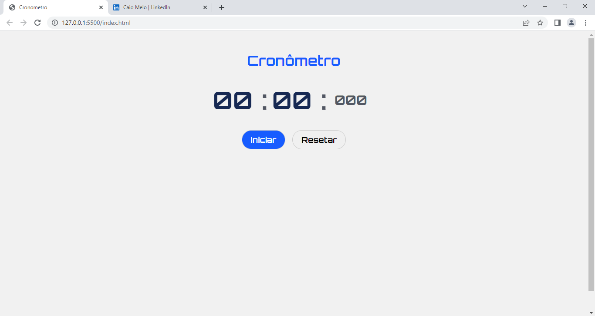

<H1>Projeto de Cronômetro com HTML, CSS, e JS </H1>

Cronômetro é um relógio projetado para medir a quantidade de tempo que decorre entre sua ativação e desativação.

confira:https://caiomelo10.github.io/Cronometro.js/

